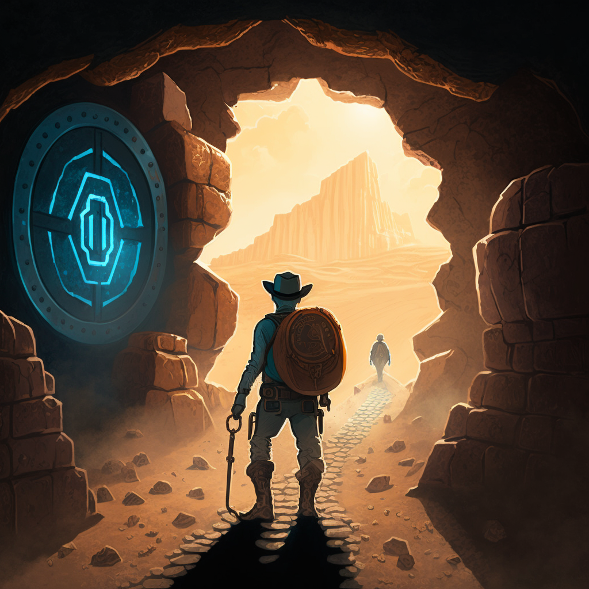

# Hero: The On-Chain Journey & Quest Engine

In life it is rare that we break from the broad-strokes of the Hero's Journey. **Hero**, is an on-chain primitive that brings this ability to Web3 with a simple, yet powerful, API.

* No rent-seeking mechanisms.
* Permissionless and ownerless from day 1.
* Bifurcated reward token model.

This primitive designed for:
* on-chain quests, journeys and rewards
* on-chain user acquisition strategies
* on-chain gamification

## The Hero's Journey



The Hero's Journey is a narrative-structured EVM-primitive built on the devices used for thousands of years to tell stories... a story of a hero who goes on a journey, and in a decisive crisis wins a victory, and then comes home changed or transformed.

In Web3, this desire has come-form from creators, organizations and communities to create a narrative structure that can be used to craft and tell user stories of their own.

Users are hard to get in Web3, but gamifying the experience is one of the most effective ways to do so. Hero is a primitive that allows you to do just that.

## The Hero's Journey API

The Hero's Journey API is a simple API that allows you to create a Journey, and for Heroes to complete Quests and earn rewards.

### The Schema of a Hero's Journey

The supporting schema of the Hero's Journey API is as follows:

```solidity
    struct Stop {
        IERC1155 badge;
        uint8 mandatory;
        uint256 id;
        uint256 balance;
    }

    struct Quest {
        address to;
        bytes data;
        uint256 value;
        uint256 stopsRequired;
        Stop[] stops;
        Reward[] rewards;
    }

    struct Reward {
        IERC1155 token;
        uint256 id;
        uint256 amount;
    }

    struct Journey {
        address caller;
        uint256 start;
        uint256 end;
        Quest[] quests;
    }
```

### `pinJourney(Journey)`

As the name suggests, this function pins a Journey to the Bulletin Board. A Journey is a collection of Quests that Heroes can embark on, to any length, criteria of completion and rewards you desire.

### `unpinJourney(Journey)`

As the inverse of `pinJourney`, this function being called by the Journey caller prevents any new Heroes from completing any quest in the Journey.

### `embark(journeyId, questId)`

This function is called by a Hero to embark on a Quest. Like the journeys and quests in your favorite books, the hero must have the required `balance` of the `badge` in their wallet to embark on the Quest.

## The badging and reward token model

With the unique approach of a bifurcated model, Hero may compensate a Hero in `Payment Tokens` as well as a `Badge`, all handled automatically in the process of completing a Quest.

This means:

* a Journey can be setup to require a Hero to have a certain amount of a token, or a certain amount of a badge, or a combination of both.

* the Quests inside a Journey can be sequential and require multiple levels of completion to increase user retention rates. As a Hero completes Level 1 Quest, they are rewarded with a Badge and gain acess to Level 2. As they complete Level 2 Quest, they are rewarded with a Badge and a Payment Token.

* the determination of `rewardEarned` is known at the time of the quest being embarked upon therefore the Hero can be rewarded immediately with no subjection to grading required. 

## Authors Note

Everyone but [RabbitHole](https://rabbithole.gg/) may copy and fork this code.